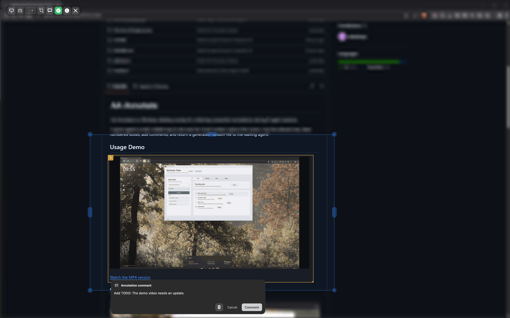
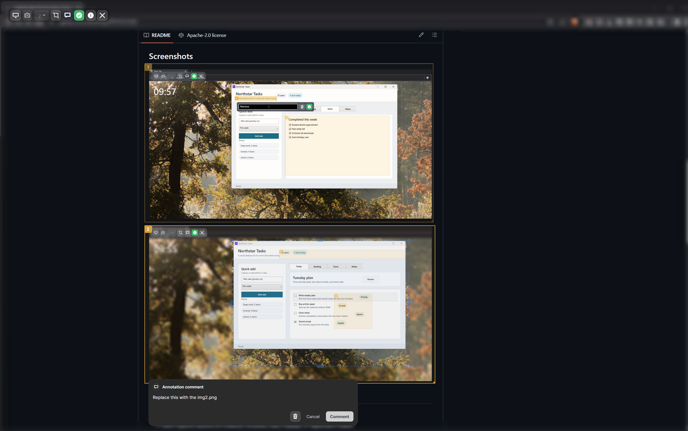

# AA Annotate

AA Annotate is a Windows desktop overlay for collecting screenshot annotations during AI agent sessions.

It gives agents a small, reliable way to ask users for visual context: capture the screen, crop the relevant area, draw numbered boxes, add comments, and return a generated handoff file to the waiting agent.

## Usage Demo

<video controls src="docs/Media/Usage_4x.mp4" width="100%">
  <a href="docs/Media/Usage_4x.mp4">Watch the usage demo</a>
</video>

If your Markdown viewer does not play embedded video, use the direct file link:
[Watch the usage demo](docs/Media/Usage_4x.mp4)

## Screenshots





## Features

- Full-screen screenshot capture for the selected display.
- Multi-capture sessions for different windows, tabs, displays, or application states.
- Crop support with blurred out-of-scope regions.
- Numbered annotation boxes with comments.
- Session output stored under the OS temp directory by default.
- Agent-facing `review.md` handoff plus structured annotation data.
- Bundled Codex skill and command-line launcher.

## Platform

Windows is supported now.

macOS and Linux support are planned for later.

## Installation

Install from the latest GitHub Release:

```powershell
powershell -ExecutionPolicy Bypass -Command "irm https://raw.githubusercontent.com/adiladiloglu/AA.Annotate/master/install.ps1 | iex"
```

The release bundle installs:

```text
App and CLI: %LOCALAPPDATA%\AA.Annotate
Codex skill: %USERPROFILE%\.codex\skills\aa-annotate
```

The default installer does not modify `PATH` and does not set persistent environment variables.

To install the bundled Codex plugin as well:

```powershell
powershell -ExecutionPolicy Bypass -Command "& ([scriptblock]::Create((irm https://raw.githubusercontent.com/adiladiloglu/AA.Annotate/master/install.ps1))) -InstallCodexPlugin"
```

### Manual Install

1. Download `aa-annotate-<version>-win-x64.zip` from the latest GitHub Release.
2. Extract the zip.
3. Run:

   ```powershell
   powershell -ExecutionPolicy Bypass -File .\install.ps1
   ```

### Optional Registration

```powershell
powershell -ExecutionPolicy Bypass -File .\install.ps1 -AddCliToUserPath
powershell -ExecutionPolicy Bypass -File .\install.ps1 -SetUserAppEnvironmentVariable
```

### Uninstall

```powershell
powershell -ExecutionPolicy Bypass -File .\uninstall.ps1
```

## Agent Usage

Agents should launch AA Annotate through the bundled CLI:

```powershell
& "$env:LOCALAPPDATA\AA.Annotate\cli\aa-annotate.exe" session --wait --timeout-seconds 60
```

To store sessions somewhere other than the OS temp directory, pass a session root:

```powershell
& "$env:LOCALAPPDATA\AA.Annotate\cli\aa-annotate.exe" session --wait --session-root "D:\AA Annotate Sessions"
```

Command help:

```powershell
& "$env:LOCALAPPDATA\AA.Annotate\cli\aa-annotate.exe" --help
& "$env:LOCALAPPDATA\AA.Annotate\app\AA.Annotate.App.exe" --help
```

When the session completes, the CLI prints:

```text
SESSION_STATUS=completed
REVIEW_MD=<session folder>\review.md
ANNOTATIONS_JSON=<session folder>\annotations.json
```

## User Workflow

1. The agent opens AA Annotate.
2. The user captures the relevant screen.
3. The user crops the capture if only part of the screen matters.
4. The user draws numbered annotation boxes.
5. The user adds comments.
6. The user sends the session back to the waiting agent.

## Agent Skill

The bundled Codex skill is installed with the app package:

```text
%USERPROFILE%\.codex\skills\aa-annotate
```

Agent-facing workflow details are documented in [skills/aa-annotate/SKILL.md](skills/aa-annotate/SKILL.md).
