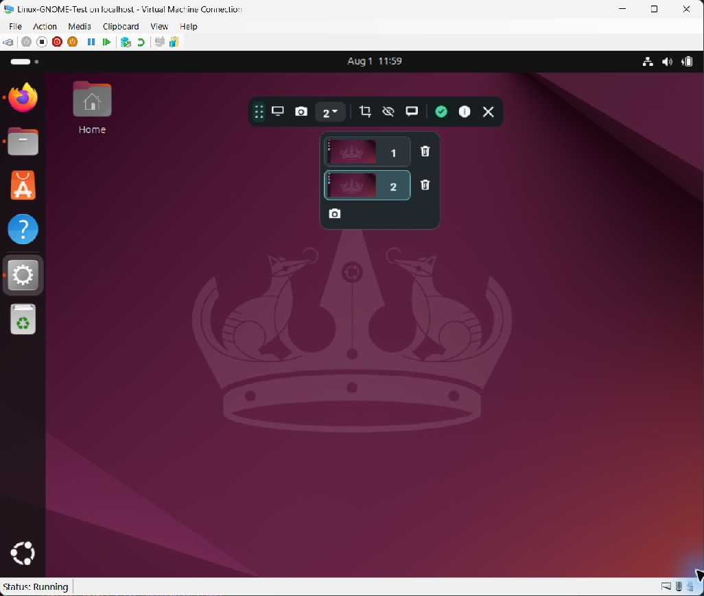
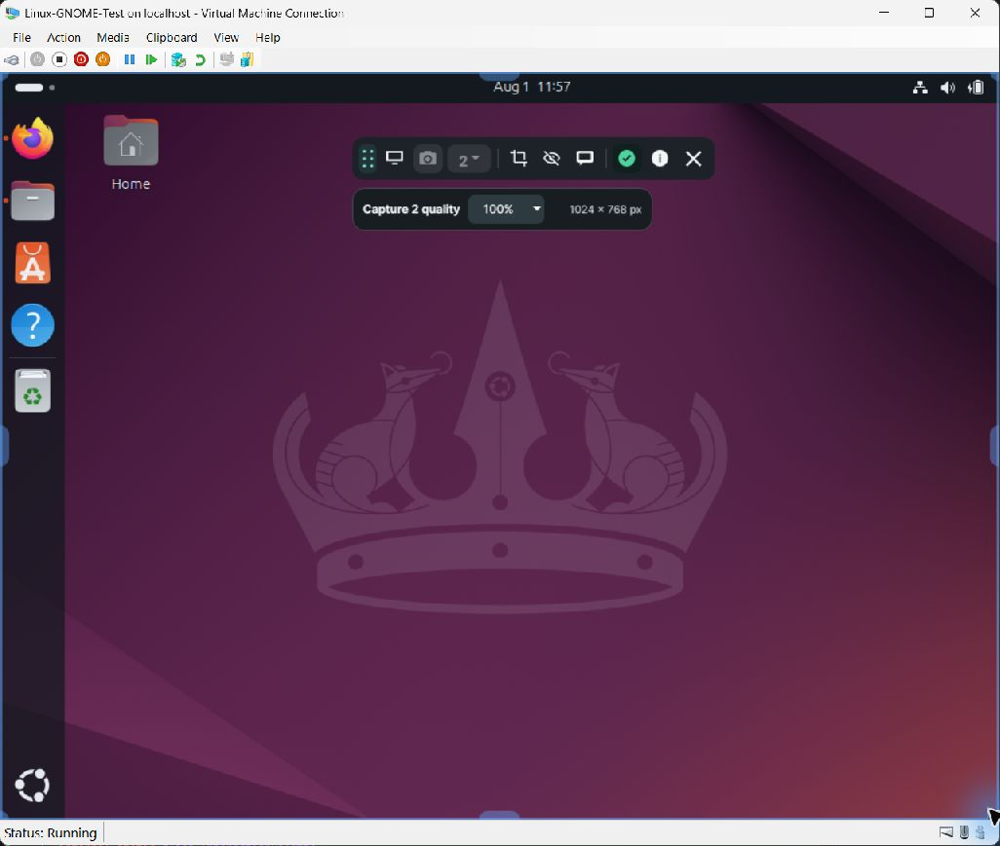
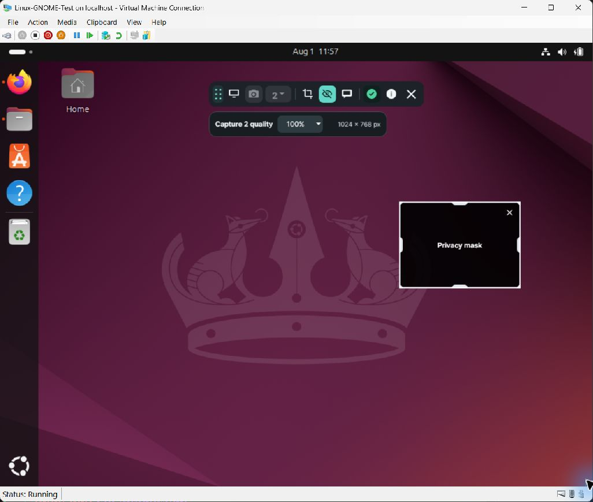
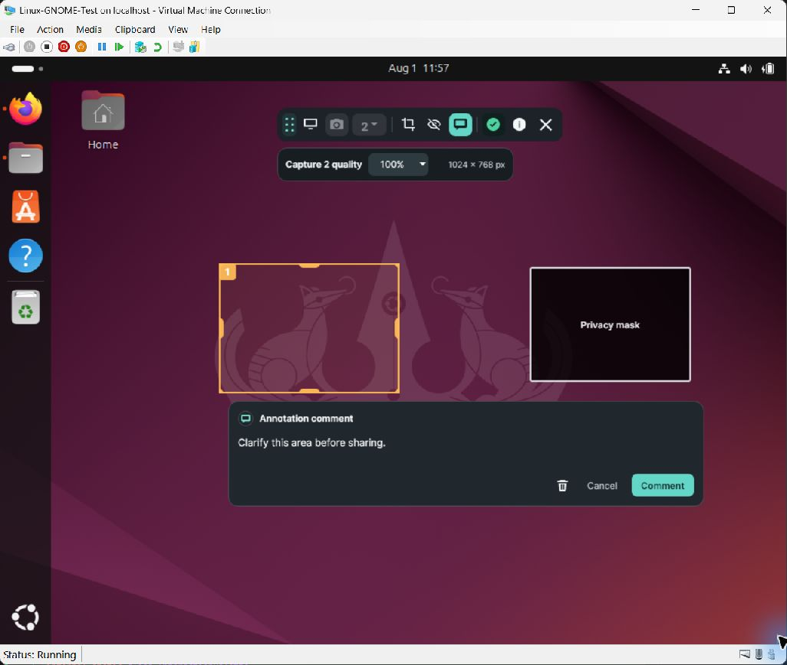

# AA.Annotate screenshot gallery

Explore the core AA.Annotate capture and review workflow.

## Multiple captures and tabs

AA.Annotate keeps each screen capture in a separate tab. Open the capture selector to switch captures, add another capture, or remove a capture from the current session.

## Crop an active capture

Select **Crop**, then resize the highlighted boundary to keep only the area that should reach the reviewer. The capture-quality selector is shown because a capture is active; it is hidden in passive mode.

## Add a privacy mask

Select **Privacy mask** and drag over sensitive content. The exported image permanently replaces the selected area with a labeled black rectangle.

## Add an annotation and comment

Select **Annotate** and drag around an area. AA.Annotate numbers the box and opens the annotation comment editor. The editor also provides actions to delete the annotation, cancel editing, or save the comment.

This example also keeps the privacy mask visible, demonstrating that masks and annotations can be combined on one capture.

## Passive toolbar on KDE Plasma

Before a capture is active, AA.Annotate presents the compact toolbar without the capture-quality selector.

